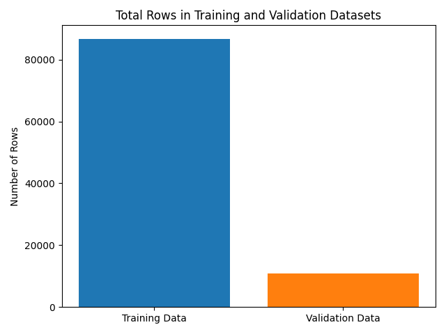
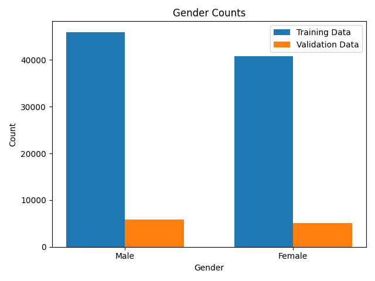
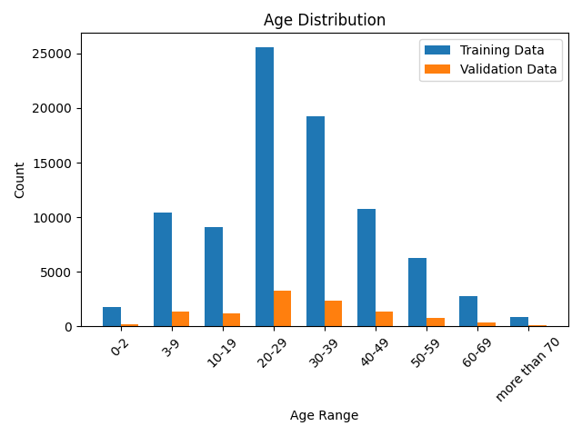
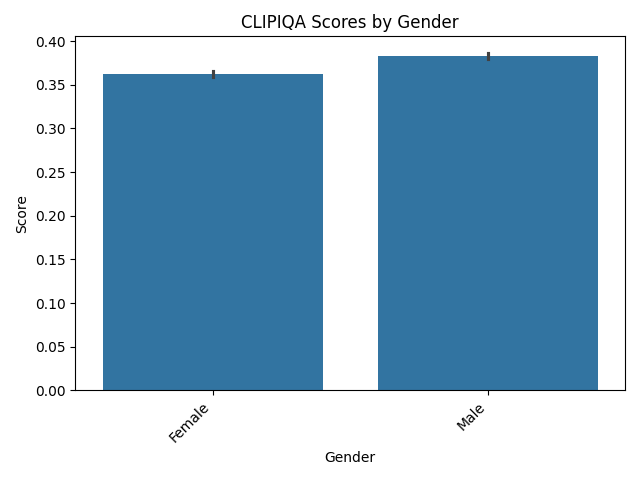

# Colorful Bias

## Table of Contents
- [Introduction](#introduction)
- [Setup and Reproduction](#setup-and-reproduction)
- [Literature Review](#literature-review)
  - [Race/Ethnicity-Annotated Face Datasets](#raceethnicity-annotated-face-datasets)
  - [Image Colorization Research](#image-colorization-research)
  - [Bias Metrics](#bias-metrics)
- [Methods](#methods)
  - [Choosing the Dataset](#choosing-the-dataset)
  - [Sampling Data](#sampling-data)
  - [Downloading Models](#downloading-models)
  - [Computing Metrics](#computing-metrics)
  - [Analyzing Colorization](#analyzing-colorization)
- [Results](#results)
  - [Recolorization](#recolorization)
  - [Barcharts](#barcharts)
  - [Facets](#facets)
  - [Joyplots](#joyplots)
  - [Summary Statistics](#summary-statistics)
  - [Multivariate Mixed-Effects Model](#multivariate-mixed-effects-model)
- [Limitations](#limitations)
- [Conclusion](#conclusion)
- [References](#references)

## Introduction

In 2015, Google Photos faced widespread backlash after its [algorithms mislabeled](https://www.nytimes.com/2023/05/22/technology/ai-photo-labels-google-apple.html) Black people as gorillas [1]. Three years later, the MIT Media Lab found that facial recognition systems had [error rates](https://www.media.mit.edu/articles/study-finds-gender-and-skin-type-bias-in-commercial-artificial-intelligence-systems/) as high as 34% for darker-skinned women compared to less than 1% for lighter-skinned men [2]. From image classification to facial recognition, computer vision is infamously flawed. In this research project, I investigated how these issues of fairness manifest in the age of generative AI. In particular, I explored the robustness of generative algorithms for image colorization with respect to skin tone bias. To accomplish this, I conducted a survey of race/ethnicity-annotated face datasets, compiled seminal algorithms for image colorization over the years, researched various formulations of bias metrics, and set up a code framework with statistical tests to rigorously compare the performance of coloring procedures. Through the above work, I sought to shed light on the trend in “colorful” bias, or bias in algorithmic colorization of images containing human skin tones, as seen through algorithms over time. Code is available at https://github.com/drakedu/colorful-bias.

## Setup and Reproduction

This project uses Python 3.11.
1. ```git clone https://github.com/drakedu/colorful-bias```
2. ```pip install requirements.txt```
3. ```python download_data.py```
4. ```python sample_data.py```
5. ```python explore_data.py```
6. ```python download_models.py```
7. ```python run_colorization.py```
8. ```python compute_metrics.py```
9. ```python analyze_colorization.py```

## Literature Review

### Race/Ethnicity-Annotated Face Datasets

Many race/ethnicity-annotated face datasets have emerged over the years. Some have faced criticism for how their data were provisioned, an issue that has afflicted computer vision and AI more broadly. One such example is MORPH-II, which, as explained in [MORPH-II: Inconsistencies and Cleaning Whitepaper](https://libres.uncg.edu/ir/uncw/f/wangy2017-1.pdf), drew from "55,134 mugshots taken between 2003 and late 2007" [3]. Beyond collection, datasets also use different localized conceptions of race/ethnicity, a potentially problematic inconsistency highlighted in [Racial Bias within Face Recognition: A Survey](https://dl.acm.org/doi/pdf/10.1145/3705295) [4] and [One Label, One Billion Faces: Usage and Consistency of Racial Categories in Computer Vision](https://arxiv.org/abs/2102.02320) [5]. Still, even if identities could be balanced in a standardized way, [What Should Be Balanced in a "Balanced" Face Recognition Dataset?](https://papers.bmvc2023.org/0235.pdf) notes that this does not ensure balance in "other factors known to impact accuracy, such as head pose, brightness, and image quality" [6]. With this context in mind, we provide an overview of a few race/ethnicity-annotated face datasets.

| Name | Year | Active | Count | Standardization | Races/Ethnicities |
| - | - | - | - | - | - |
| [MORPH-II](https://libres.uncg.edu/ir/uncw/f/wangy2017-1.pdf) | 2006 | No | 55134 | No | Asian, Black, Hispanic, White |
| [Face Place](https://sites.google.com/andrew.cmu.edu/tarrlab/stimuli#h.u2lsuc5ur5gt) | 2008 | Yes | 235 | Yes | Asian, Black, Caucasian, Hispanic, Multiracial |
| [Todorov 13125](https://tlab.uchicago.edu/databases/) | 2013 | Yes | 13125 | Yes | Asian, Black, White |
| [CFD](https://www.chicagofaces.org/) | 2015 | Yes | 827+ | Yes | Asian, Black, Latino, White |
| [RFW](http://www.whdeng.cn/RFW/index.html) | 2018 | Yes | 40607 | Yes | African, Asian, Caucasian, Indian |
| [UTKFace](https://github.com/aicip/UTKFace) | 2019  | No | 20000+ | No | Asian, Black, Indian, White |
| [DemogPairs](https://ihupont.github.io/publications/2019-05-16-demogpairs) | 2019 | Yes | 10800 | Yes | Asian, Black, White |
| [DiveFace](https://github.com/BiDAlab/DiveFace) | 2019 | Yes | 150000+ | Yes | Caucasian, East Asian, Sub-Saharan and South Indian |
| [BFW](https://github.com/visionjo/facerec-bias-bfw) | 2020 | No | 20000+ | Yes | Asian, Black, Indian, White |
| [VMER](https://link.springer.com/article/10.1007/s00138-020-01123-z) | 2020 | No | 3000000+ | Yes | African American, Asian Indian, Caucasian Latin, East Asian |
| [FDEA](https://github.com/GZHU-DVL/FDEA) | 2021  | No | 157801 | Yes | African, Asian, Caucasian |
| [FairFace](https://github.com/dchen236/FairFace) | 2021 | Yes | 108501 | No | Asian, Black, Indian, White |
| [FaceARG](https://www.cs.ubbcluj.ro/~dadi/FaceARG-database.html) | 2021 | Yes | 175000+ | Yes | African-American, Asian, Caucasian, Indian |
| [BUPT-BalancedFace](http://www.whdeng.cn/RFW/Trainingdataste.html) | 2022 | Yes | 1300000+ | Yes | African, Asian, Caucasian, Indian |

### Image Colorization Research

Strategies for image colorization have evolved over the years and feature a diversity of AI frameworks as well as user inputs. Some examples of unsupervised methods include focus on random fields [7, 8], stochastic sampling [9], deep neural networks [10, 11, 12, 13, 14], encoders and decoders [15, 16], convolutional neural networks [17, 18, 19, 20], generative adversarial networks [21, 22, 23, 24], instance-aware coloring [25, 26, 27], transformers [28, 29, 30], and transfer learning [31]. Likewise, supervised methods leverage sample scribbles and strokes [32, 33, 34, 35, 36, 37, 38, 39], reference images or patches [40, 41, 42, 43, 44, 45, 46, 47, 48, 49, 50, 51, 52, 53, 54, 55, 56, 57, 58], target color palettes and pixels [59, 60, 61, 62], text descriptions [63, 64, 65, 66, 67, 68], and multimodal combinations of these [69, 70, 71, 72]. Here, we provide an in-depth overview of research papers on image colorization.

| Title | Year | Author(s) | Supervision | Implementation |
| - | - | - | - | - |
| [Color Transfer between Images](https://www.researchgate.net/publication/220518215_Color_Transfer_between_Images) | 2001 | Reinhard et al. | Yes | https://github.com/chia56028/Color-Transfer-between-Images |
| [Transferring Color to Greyscale Images](https://www.researchgate.net/publication/220183710_Transferring_Color_to_Greyscale_Images) | 2002 | Welsh et al. | Yes | https://github.com/h-wang94/ImageColorization |
| [Colorization Using Optimization](https://dl.acm.org/doi/10.1145/1015706.1015780) | 2004 | Levin et al. | Yes | https://github.com/soumik12345/colorization-using-optimization |
| [Colorization by Example](https://dl.acm.org/doi/10.5555/2383654.2383683) | 2005 | Irony et al. | Yes | None |
| [Fast Image and Video Colorization Using Chrominance Blending](https://www.researchgate.net/publication/7109910_Fast_image_and_video_colorization_using_chrominance_blending) | 2006 | Yatziv & Sapiro | Yes | None |
| [Intrinsic Colorization](https://www.semanticscholar.org/paper/Intrinsic-colorization-Liu-Wan/448adcd417c44555cb136be8101ee86ac521fb9f) | 2008 | Liu et al. | Yes | None |
| [Image Colorization Using Similar Images](https://dl.acm.org/doi/10.1145/2393347.2393402) | 2012 | Gupta et al. | Yes | None |
| [Image Colorization Using Sparse Representation](https://www.researchgate.net/publication/261282221_Image_colorization_using_sparse_representation) | 2013 | Pang et al. | Yes | None |
| [Example-based Image Colorization using Locality Consistent Sparse Representation](https://users.cs.cf.ac.uk/Paul.Rosin/resources/papers/colourisation-TIP-postprint.pdf) | 2014 | Li et al. | Yes | None |
| [Learning Large-Scale Automatic Image Colorization](https://openaccess.thecvf.com/content_iccv_2015/papers/Deshpande_Learning_Large-Scale_Automatic_ICCV_2015_paper.pdf) | 2015 | Deshpande et al. | No | https://github.com/aditya12agd5/iccv15_lscolorization |
| [Palette-based Photo Recoloring](https://gfx.cs.princeton.edu/pubs/Chang_2015_PPR/chang2015-palette_small.pdf) | 2015 | Chang et al. | Yes | https://github.com/b-z/photo_recoloring |
| [Deep Colorization](https://www.researchgate.net/publication/301818846_Deep_Colorization) | 2016 | Cheng et al. | No | None |
| [Colorful Image Colorization](https://arxiv.org/abs/1603.08511) | 2016 | Zhang et al. | No | https://github.com/richzhang/colorization |
| [Let There Be Color](https://dl.acm.org/doi/10.1145/2897824.2925974) | 2016 | Iizuka et al. | No | https://github.com/satoshiiizuka/siggraph2016_colorization |
| [Learning Representations for Automatic Colorization](https://arxiv.org/abs/1603.06668) | 2016 | Larsson et al. | No | https://github.com/gustavla/autocolorize |
| [Unsupervised Diverse Colorization via Generative Adversarial Networks](https://arxiv.org/abs/1702.06674) | 2017 | Cao et al. | No | https://github.com/ccyyatnet/COLORGAN |
| [Real-Time User-Guided Image Colorization with Learned Deep Priors](https://arxiv.org/abs/1705.02999) | 2017 | Zhang et al. | Yes | https://github.com/junyanz/interactive-deep-colorization | 
| [Probabilistic Image Colorization](https://www.researchgate.net/publication/316875180_Probabilistic_Image_Colorization) | 2017 | Royer et al. | No | https://github.com/ameroyer/PIC |
| [Outline Colorization through Tandem Adversarial Networks](https://arxiv.org/abs/1704.08834) | 2017 | Frans | Yes | None |
| [Learning Diverse Image Colorization](https://openaccess.thecvf.com/content_cvpr_2017/papers/Deshpande_Learning_Diverse_Image_CVPR_2017_paper.pdf) | 2017 | Deshpande et al. | No | https://github.com/aditya12agd5/divcolor |
| [Image Colorization using CNNs and Inception-ResNet-v2](https://arxiv.org/abs/1712.03400) | 2017 | Baldassarre et al. | No | https://github.com/baldassarreFe/deep-koalarization |
| [Controlling Deep Image Synthesis with Sketch and Color](https://openaccess.thecvf.com/content_cvpr_2017/papers/Sangkloy_Scribbler_Controlling_Deep_CVPR_2017_paper.pdf) | 2017 | Sangkloy et al. | Yes | None |
| [Deep Exemplar-Based Colorization](https://www.researchgate.net/publication/326726827_Deep_exemplar-based_colorization) | 2018 | He et al. | Yes | https://github.com/msracver/Deep-Exemplar-based-Colorization | 
| [Deep Image Prior](https://ieeexplore.ieee.org/document/8579082) | 2018 | Lempitsky et al. | No | https://github.com/DmitryUlyanov/deep-image-prior |
| [DeOldify](https://github.com/jantic/DeOldify) | 2018 | Antic | No | https://github.com/jantic/DeOldify |
| [TextureGAN: Controlling Deep Image Synthesis with Texture Patches](https://openaccess.thecvf.com/content_cvpr_2018/papers/Xian_TextureGAN_Controlling_Deep_CVPR_2018_paper.pdf) | 2018 | Xian et al. | Yes | https://github.com/janesjanes/Pytorch-TextureGAN |
| [Two-Stage Sketch Colorization](https://ttwong12.github.io/papers/colorize/colorize.pdf) | 2018 | Zhang et al. | Yes | None |
| [Learning to Color from Language](https://arxiv.org/pdf/1804.06026) | 2018 | Manjunatha et al. | Yes | https://github.com/superhans/colorfromlanguage |
| [Language-Based Image Editing with Recurrent Attentive Models](https://arxiv.org/pdf/1711.06288) | 2018 | Chen et al. | Yes | https://github.com/Jianbo-Lab/LBIE |
| [Structural Consistency and Controllability for Diverse Colorization](https://openaccess.thecvf.com/content_ECCV_2018/papers/Safa_Messaoud_Structural_Consistency_and_ECCV_2018_paper.pdf) | 2018 | Messaoud et al. | No | None |
| [Awesome Image Colorization](https://github.com/MarkMoHR/Awesome-Image-Colorization) | 2018 | Mo et al. | Yes | https://github.com/MarkMoHR/Awesome-Image-Colorization | 
| [Coloring with Words: Guiding Image Colorization Through Text-based Palette Generation](https://arxiv.org/pdf/1804.04128) | 2018 | Bahng et al. | Yes | https://github.com/awesome-davian/Text2Colors/ |
| [Pixelated Semantic Colorization](https://arxiv.org/abs/1901.10889) | 2019 | Zhao et al. | No | None |
| [Fully Automatic Video Colorization with Self-Regularization and Diversity](https://arxiv.org/pdf/1908.01311) | 2019 | Lei & Chen | No | https://github.com/ChenyangLEI/automatic-video-colorization |
| [A Superpixel-Based Variational Model for Image Colorization](https://ieeexplore.ieee.org/abstract/document/8676327) | 2019 | Fang et al. | Yes | None |
| [Adversarial Colorization Of Icons Based On Structure And Color Conditions](https://arxiv.org/pdf/1910.05253) | 2019 | Sun et al. | Yes | https://github.com/jxcodetw/Adversarial-Colorization-Of-Icons-Based-On-Structure-And-Color-Conditions |
| [Automatic Example-Based Image Colorization Using Location-Aware Cross-Scale Matching](https://ieeexplore.ieee.org/abstract/document/8699109) | 2019 | Li et al. | Yes | None |
| [Coloring With Limited Data: Few-Shot Colorization via Memory Augmented Networks](https://openaccess.thecvf.com/content_CVPR_2019/papers/Yoo_Coloring_With_Limited_Data_Few-Shot_Colorization_via_Memory_Augmented_Networks_CVPR_2019_paper.pdf) | 2019 | Yoo et al. | No | https://github.com/dongheehand/MemoPainter-PyTorch |
| [ChromaGAN: Adversarial Picture Colorization with Semantic Class Distribution](https://arxiv.org/abs/1907.09837) | 2020 | Vitoria et al. | No | https://github.com/pvitoria/ChromaGAN |
| [Instance-Aware Image Colorization](https://arxiv.org/abs/2005.10825) | 2020 | Su et al. | No | https://github.com/ericsujw/InstColorization |
| [Reference-Based Sketch Image Colorization using Augmented-Self Reference and Dense Semantic Correspondence](https://openaccess.thecvf.com/content_CVPR_2020/papers/Lee_Reference-Based_Sketch_Image_Colorization_Using_Augmented-Self_Reference_and_Dense_Semantic_CVPR_2020_paper.pdf) | 2020 | Lee et al. | Yes | None |
| [Stylization-Based Architecture for Fast Deep Exemplar Colorization](https://openaccess.thecvf.com/content_CVPR_2020/papers/Xu_Stylization-Based_Architecture_for_Fast_Deep_Exemplar_Colorization_CVPR_2020_paper.pdf) | 2020 | Xu et al. | Yes | https://github.com/xuzhongyou/Colorization |
| [Image Colorization: A Survey and Dataset](https://arxiv.org/abs/2008.10774) | 2020 | Anwar et al. | No | https://github.com/saeed-anwar/ColorSurvey | 
| [Gray2ColorNet: Transfer More Colors from Reference Image](https://dl.acm.org/doi/abs/10.1145/3394171.3413594) | 2020 | Lu et al. | Yes | https://github.com/CV-xueba/Gray2ColorNet | 
| [Colorization Transformer](https://arxiv.org/abs/2102.04432) | 2021 | Kumar et al. | No | https://github.com/google-research/google-research/tree/master/coltran |
| [Colorizing Old Images Learning from Modern Historical Movies](https://arxiv.org/abs/2108.06515) | 2021 | Jin et al. | No | https://github.com/BestiVictory/HistoryNet |
| [Yes, "Attention Is All You Need", for Exemplar based Colorization](https://dl.acm.org/doi/abs/10.1145/3474085.3475385) | 2021 | Yin et al. | Yes | None |
| [User-Guided Line Art Flat Filling with Split Filling Mechanism](https://openaccess.thecvf.com/content/CVPR2021/papers/Zhang_User-Guided_Line_Art_Flat_Filling_With_Split_Filling_Mechanism_CVPR_2021_paper.pdf) | 2021 | Zhang et al. | Yes | https://github.com/lllyasviel/SplitFilling |
| [Towards Vivid and Diverse Image Colorization with Generative Color Prior](https://arxiv.org/abs/2108.08826) | 2021 | Wu et al. | No | https://github.com/ToTheBeginning/GCP-Colorization |
| [Dual Color Space Guided Sketch Colorization](https://ieeexplore.ieee.org/abstract/document/9515572) | 2021 | Dou et al. | Yes | None |
| [Globally and Locally Semantic Colorization via Exemplar-Based Broad-GAN](https://ieeexplore.ieee.org/abstract/document/9566701) | 2021 | Li et al. | Yes | None |
| [Deep Edge-Aware Interactive Colorization against Color-Bleeding Effects](https://arxiv.org/abs/2107.01619) | 2021 | Kim et al. | Yes | https://github.com/niceDuckgu/CDR |
| [Bridging the Domain Gap towards Generalization in Automatic Colorization](https://www.ecva.net/papers/eccv_2022/papers_ECCV/papers/136770530.pdf) | 2022 | Lee et al. | No | https://github.com/Lhyejin/DG-Colorization |
| [ColorFormer: Image Colorization via Color Memory assisted Hybrid-attention Transformer](https://www.ecva.net/papers/eccv_2022/papers_ECCV/papers/136760020.pdf) | 2022 | Ji et al. | No | https://github.com/jixiaozhong/ColorFormer |
| [BigColor: Colorization using a Generative Color Prior for Natural Images](https://kimgeonung.github.io/bigcolor/) | 2022 | Kim et al. | No | https://github.com/KIMGEONUNG/BigColor |
| [Semantic-Sparse Colorization Network for Deep Exemplar-based Colorization](https://arxiv.org/abs/2112.01335) | 2022 | Bai et al. | Yes | https://github.com/bbaaii/SSC-Net |
| [Lightweight Deep Exemplar Colorization via Semantic Attention-Guided Laplacian Pyramid](https://ieeexplore.ieee.org/abstract/document/10526459) | 2022 | Zou et al. | Yes | None |
| [UniColor: A Unified Framework for Multi-Modal Colorization with Transformer](https://arxiv.org/abs/2209.11223) | 2022 | Huang et al. | No | https://github.com/luckyhzt/unicolor |
| [Unsupervised Deep Exemplar Colorization via Pyramid Dual Non-Local Attention](https://ieeexplore.ieee.org/abstract/document/10183846) | 2022 | Wang et al. | Yes | https://github.com/wd1511/PDNLA-Net |
| [DDColor: Towards Photo-Realistic Image Colorization via Dual Decoders](https://arxiv.org/abs/2212.11613) | 2023 | Kang et al. | No | https://github.com/piddnad/DDColor |
| [Improved Diffusion-based Image Colorization via Piggybacked Models](https://arxiv.org/abs/2304.11105) | 2023 | Liu et al. | No | https://github.com/hyliu/piggyback-color |
| [Two-Step Training: Adjustable Sketch Colourization via Reference Image and Text Tag](https://onlinelibrary.wiley.com/doi/full/10.1111/cgf.14791) | 2023 | Yan et al. | Yes | https://github.com/tellurion-kanata/sketch_colorizer |
| [Diffusing Colors: Image Colorization with Text Guided Diffusion](https://arxiv.org/abs/2312.04145) | 2023 | Zabari et al. | Yes | None |
| [Region Assisted Sketch Colorization](https://ieeexplore.ieee.org/abstract/document/10303276) | 2023 | Wang et al. | Yes | None |
| [L-CoIns: Language-based Colorization with Instance Awareness](https://openaccess.thecvf.com/content/CVPR2023/papers/Chang_L-CoIns_Language-Based_Colorization_With_Instance_Awareness_CVPR_2023_paper.pdf) | 2023 | Chang et al. | Yes | https://github.com/changzheng123/L-CoIns |
| [iColoriT: Towards Propagating Local Hint to the Right Region in Interactive Colorization by Leveraging Vision Transformer](https://arxiv.org/pdf/2207.06831) | 2023 | Yun et al. | Yes | https://github.com/pmh9960/iColoriT |
| [Adding Conditional Control to Text-to-Image Diffusion Models](https://openaccess.thecvf.com/content/ICCV2023/papers/Zhang_Adding_Conditional_Control_to_Text-to-Image_Diffusion_Models_ICCV_2023_paper.pdf) | 2023 | Zhang et al. | Yes | https://github.com/lllyasviel/ControlNet |
| [L-CAD: Language-based Colorization with Any-level Descriptions using Diffusion Priors](https://arxiv.org/abs/2305.15217) | 2023 | Chang et al. | Yes | https://github.com/changzheng123/L-CAD |
| [Automatic Controllable Colorization via Imagination](https://arxiv.org/abs/2404.05661) | 2024 | Cong et al. | No | https://github.com/xy-cong/imagine-colorization |
| [Control Color: Multimodal Diffusion-based Interactive Image Colorization](https://arxiv.org/abs/2402.10855) | 2024 | Liang et al. | Yes | None |
| [Versatile Vision Foundation Model for Image and Video Colorization](https://dl.acm.org/doi/abs/10.1145/3641519.3657509) | 2024 | Bozic et al. | Yes | None |

### Bias Metrics

Various conceptualizations of bias have emerged in the image colorization space. Broadly, they include absolute metrics based on geometry, perceptual metrics based on non-uniformities in human color vision, and semantic metrics measuring how well the colorization preserves the semantic meaning of the image. Metrics can further be divided into those requiring a reference image and those that are automatic based on deep learning methods as explained in [Comparison of Metrics for Colorized Image Quality
Evaluation](https://www.vcl.fer.hr/papers_pdf/Comparison%20of%20Metrics%20for%20Colorized%20Image%20Quality%20Evaluation.pdf) [73]. As of December 2024, the two leading Python libraries for image quality assessment (IQA) include PyTorch Toolbox for Image Quality Assessment (PIQA) and PyTorch Image Quality (PIQ). Here, we provide a sampling of bias metrics over the years.

| Metric | Year | Type | Reference |
| - | - | - | - |
| Mean Squared Error (MSE) | - | Absolute | Yes |
| Mean Absolute Error (MAE) | - | Absolute | Yes |
| Peak Signal-to-Noise Ratio (PSNR) | - | Absolute | Yes |
| Kullback–Leibler Divergence (KL) | 1951 | Absolute | Yes |
| Earth Mover’s Distance (EMD) | 1989 | Absolute | Yes |
| CIEDE2000 | 2001 | Perceptual | Yes |
| Universal Image Quality Index (UIQI) | 2002 | Absolute | Yes |
| Structural Similarity Index Measure (SSIM) | 2004 | Perceptual | Yes |
| Visual Information Fidelity (VIF) | 2006 | Absolute | Yes |
| Feature Similarity Index Measure (FSIM) | 2011 | Perceptual | Yes |
| Naturalness Image Quality Evaluator (NIQE) | 2012 | Perceptual | No |
| Blind/Referenceless Image Spatial Quality Evaluator (BRISQUE) | 2012 | Perceptual | No |
| Gradient Magnitude Similarity Deviation (GMSD) | 2013 | Absolute | Yes |
| Learned Perceptual Image Patch Similarity (LPIPS) | 2018 | Semantic | Yes |
| Neural Image Assessment (NIMA) | 2018 | Perceptual | No |
| Deep Bilinear Convolutional Neural Network (DBCNN) | 2020 | Perceptual | No |
| Multi-Scale Image Quality Transformer (MUSIQ) | 2021 | Perceptual | No |

## Methods

### Choosing the Dataset

For this research project, [FairFace](https://github.com/dchen236/FairFace) was employed as the source of race/ethnicity-annotated facial images [74]. This was because FairFace provides wide demographic coverage, including 9 distinct age groups, 7 race/ethnicity categories, and 2 gender groups, for 126 demographic subgroups. Additionally, the dataset is large enough that each individual age-gender-race subgroup contains at least 22 unique images, facilitating statistical analyses. Lastly, FairFace is openly accessible and does not require specific permissions, thereby facilitating the reproducibility and extension of this research project. Below, we display the results of ```explore_data.py```. We can see that the dataset is somewhat imbalanced by all of age, race, and gender and that the smallest age-gender-race subgroup has 22 images.

<table>
  <tr>
    <td></td>
    <td></td>
  </tr>
  <tr>
    <td></td>
    <td></td>
  </tr>
</table>

|Gender|Race|0-2|10-19|20-29|3-9|30-39|40-49|50-59|60-69|More than 70|
|------|----|---|-----|-----|----|-----|-----|-----|-----|------------|
|Female|Black|91.0|850.0|1769.0|842.0|1323.0|682.0|371.0|165.0|44.0|
|Female|East Asian|146.0|632.0|2902.0|675.0|1115.0|348.0|186.0|94.0|43.0|
|Female|Indian|78.0|890.0|1704.0|695.0|1164.0|659.0|388.0|224.0|107.0|
|Female|Latino_Hispanic|107.0|918.0|2004.0|837.0|1375.0|832.0|426.0|161.0|55.0|
|Female|Middle Eastern|28.0|343.0|1041.0|248.0|616.0|327.0|155.0|67.0|22.0|
|Female|Southeast Asian|76.0|718.0|1871.0|702.0|916.0|412.0|258.0|136.0|94.0|
|Female|White|166.0|646.0|2972.0|640.0|1911.0|814.0|410.0|193.0|74.0|
|Male|Black|188.0|668.0|1402.0|1230.0|1296.0|777.0|393.0|114.0|28.0|
|Male|East Asian|262.0|544.0|1863.0|1061.0|1267.0|591.0|338.0|176.0|44.0|
|Male|Indian|91.0|639.0|1373.0|835.0|1607.0|976.0|596.0|233.0|60.0|
|Male|Latino_Hispanic|82.0|691.0|1527.0|752.0|1557.0|1125.0|698.0|194.0|26.0|
|Male|Middle Eastern|106.0|392.0|1282.0|473.0|1782.0|1190.0|682.0|368.0|94.0|
|Male|Southeast Asian|138.0|670.0|1639.0|821.0|1093.0|646.0|358.0|171.0|76.0|
|Male|White|233.0|502.0|2249.0|597.0|2228.0|1365.0|969.0|483.0|75.0|


### Sampling Data

To facilitate consistency and comparability across demographic subgroups, we randomly sampled 22 images from each of the 126 demographic categories as defined by unique combinations of age, race/ethnicity, and gender, for a total of 2772 ground-truth images. By setting a baseline per subgroup, we ensured that every group was represented with an equal amount of data, mitigating potential issues arising from imbalanced class sizes.

### Downloading Models

While many colorization models have been proposed over the years, a sizeable proportion of them lack open-source implementations. For this research project, we spent 30 minutes attempting to set up each of 37 different models, of which 5 were successfully integrated. These included [Color Transfer between Images](https://www.researchgate.net/publication/220518215_Color_Transfer_between_Images) [40], [Colorful Image Colorization](https://arxiv.org/abs/1603.08511) [17], [Real-Time User-Guided Image Colorization with Learned Deep Priors](https://arxiv.org/abs/1705.02999) [18], [DeOldify](https://github.com/jantic/DeOldify) [75], and [DDColor: Towards Photo-Realistic Image Colorization via Dual Decoders](https://arxiv.org/abs/2212.11613) [16]. Due to time constraints, 9 other models received no attempt. Issues included datasets and pre-trained models no longer being publicly available, deprecated packages no longer being offered by channels such as Conda, stringent GPU requirements, macOS incompatibilities with LuaJIT and Caffe, intractable user input requirements, and domain limitations.

### Computing Metrics

To determine quality of image recolorization, we leveraged the PyTorch Toolbox for Image Quality Assessment due to its support of a wide-range of seminal metrics and ease of use. Out of the 38 metrics supported by the library, we were able to compute 28 of them for each of the 13860 image recolorings across the 5 models, possible largely by the help of 6 additional computers in Lamont Library and the blessing of library staff. Q-Align, AHIQ, TReS, MANIQA, ILNIQE, HyperIQA, BRISQUE, NRQM, and PI were projected to take 10 days, 5 days, 4 days, 3 days, 1 day, 16 hours, 15 hours, 7 hours, and 6 hours, respectively, while FID lacked a default image dataset fallback. All 28 metrics taking at most around 6 hours were successfully computed. 

### Analyzing Colorization

After computing metrics between ground-truth images and reconstructions, we first explored differences across groups using joyplots, facets, and CI-annotated barcharts. Next, we computed summary statistics for every age-gender-race-model combination, inclusive of an `All` keyword, to cover varying aggregations. We then tackled the central question of how demographic disparities in reconstructions differ by colorization algorithm by designing a multivariate mixed-effects model, as it offered a comprehensive, nuanced, and statistically principled framework for our research aims. We recognized that each grayscale image was processed by multiple recolorization models, leading to repeated measures per subject. Leveraging a mixed-effects model naturally accommodated this structure by including random intercepts to capture the inherent variability between subjects, as opposed to treating all observations as independent. This ensured that inference about fixed effects such as the influence of model, race, and their interaction was not confounded by unmodeled differences among images. Additionally, we chose a multivariate approach as we computed 28 different metrics of reconstruction quality, and analyzing these metrics separately would ignore their potentially informative correlations, an idea rooted in both their known explicit relationships as well as possible latent ones. Thus, by including all metrics in a single joint model, this allowed us to determine how disparities manifest through multiple dimensions of quality. Initially, as one might, we sought to look at the within-subject effect of models; the between-subject effects of age, gender, and race; and all interaction terms between these. However, due to computing constraints, we ended up focusing on model, race, and their interaction. Additionally, we tried to fit a multivariate mixed-effects model with all 28 metrics. However, this exhausted the $50 in cloud compute purchased for the research project as the fitting became increasingly intractable over a span of a few days. As such, for the response variable, I ended up choosing a random 3-sized subset of the 28 metrics in conversation with Jay Pratap. For our normal priors on `mu_subject` and `beta`, we chose standard normals inline with common defaults in hierarchical models as they are neither too tight nor too loose and offer enough flexibility for the data to influence the posterior estimates. Similarly, we set `eta=2` for our Lewandowski-Kurowicka-Joe prior to gently shrink correlations toward zero without overly constraining them. Lastly, we had `Exponential(1.0)` for `sd_dist` to favor smaller standard deviations but still allow for larger values if warranted by the data.

## Results

### Recolorization

Each of the 5 models was able to colorize every one of the 2772 ground truth images over the span of 2 days. Here we have a grid of recolorized images from each model displayed against the ground truth, with one sample from each of the 14 race-gender groupings. Differences in the colorization results across the models are clearly visible.


### Barcharts

For each metric, we created CI-annotated barcharts to visualize average scores when stratifying by 4 factors: age, gender, race, and model. Here, we look at a subset of results. For NLPD, we very clearly see differences in scores across models. Interestingly, the most recent model of 2023 Kang performs worst on average, as lower scores are better for this metric. For CLIPIQA, we see a difference in performance by gender, with images of male subjects having better reconstructions by this metric than female subjects. For PieAPP, we see differences in performance by race, with images of White and Middle Eastern subjects having the best reconstruction scores. Lastly, for no-reference WaDIQaM, we can see noticeable differences in scores across ages, with subjects up to 2 years old or above 70 scoring highest on reconstruction.

<table>
  <tr>
    <td></td>
    <td></td>
  </tr>
  <tr>
    <td></td>
    <td></td>
  </tr>
</table>

### Facets

For each metric, we created two-dimensional facets based on all 6 pairs among age, gender, race, and model. Here we look at an example result for full-reference TOPIQ. We can see that for this metric, scores vary widely by model, whereas only small effects can be seen for gender.

/facets/gender_model.png)

### Joyplots

To get a big picture understanding of score range and behavior across groups for each metric, we created joyplots for all 16 subsets of age-gender-race-model. Here, we have the gender-race-model joyplot for ARNIQA.


### Summary Statistics

Our last batch of exploratory data analysis for each metric was creating summary statistics. We computed all 1440 age-gender-race-model combinations inclusive of an `All` keyword to cover varying aggregations. Below are the top 20 rows of summary statistics for PSNR.

|Age|Gender|Race|Model|Mean|Median|Standard Deviation|IQR|Lower Better|
|---|---|---|---|---|---|---|---|---|
|All|All|All|All|23.746290785512883|23.62385654449463|4.551968465979468|4.869461536407467|False|
|0-2|All|All|All|23.25450802035146|23.096850395202637|4.574577868895466|4.806198596954346|False|
|10-19|All|All|All|23.41152549409247|23.204188346862793|4.093194870515825|5.070611000061035|False|
|20-29|All|All|All|24.29193657775978|24.058866500854492|4.462347841180699|4.631749629974365|False|
|3-9|All|All|All|22.80049496625925|22.655241012573242|4.212472107822797|4.988142490386966|False|
|30-39|All|All|All|24.109582820496|24.011911392211914|4.54354956306265|5.233553886413574|False|
|40-49|All|All|All|23.95283812981147|24.06586456298828|4.044056115067646|5.028602123260498|False|
|50-59|All|All|All|23.59485093463551|23.695880889892578|4.344434640209412|4.74501466751099|False|
|60-69|All|All|All|24.039917325973512|23.895816802978516|4.788069408201891|4.582380294799805|False|
|more than 70|All|All|All|24.26096280023649|23.863627433776855|5.509883090844478|4.566039085388184|False|
|All|Female|All|All|23.602220069588004|23.4708890914917|4.388108771548343|4.7810282707214355|False|
|All|Male|All|All|23.890361501437763|23.784811973571777|4.706039406627894|4.937168121337891|False|
|All|All|Black|All|23.5398264986096|23.437650680541992|4.60592190395045|4.775972366333011|False|
|All|All|East Asian|All|23.597166728491736|23.55604362487793|4.239379111993309|4.737373352050781|False|
|All|All|Indian|All|23.692256008494983|23.605233192443848|4.544037389637518|5.095743656158447|False|
|All|All|Latino_Hispanic|All|23.912411434481843|23.870217323303223|4.425471819034588|4.806936740875244|False|
|All|All|Middle Eastern|All|24.27284752046219|23.935327529907227|4.973672409091583|4.832328796386719|False|
|All|All|Southeast Asian|All|23.386926381274908|23.245975494384766|4.832221078581255|5.064819812774658|False|
|All|All|White|All|23.82260092677492|23.65176773071289|4.134025545706683|4.709608078002926|False|
|All|All|All|2001 Reinhard|25.121037349384412|24.09907341003418|6.857395120869607|4.674080848693848|False|

### Multivariate Mixed-Effects Model

Fitting our reduced-scale multivariate mixed-effects model with 1000 draws and 2 chains took 3 hours, after which we stored our trace in `multivariate_mixed_effects_model_trace.nc`. For our particular run, our randomly selected subset of metrics consisted of `NIQE`, `PSNR`, and `MUSIQ`. PyMC reported that the effective sample size per chain was smaller than 100 for some parameters, which was expected given our limited image dataset. From our resulting trace, we focused on our coefficients and covariances by creating 2 files: `multivariate_mixed_effects_model_cov.csv` and `multivariate_mixed_effects_model_betas.csv`. In our covariances file, we saw that out of the 3 pairs among the 3 metrics, 1 featured a large correlation. Specifically, we saw that NIQE and MUSIQ scores had a correlation of $-0.83$. This supports our model design as utilizing a multivariate approach allowed us to capture important cross-metric relationships that would have been missed by modeling each metric independently. We can also see this visually through a heatmap.


Next, we look at our coefficients. `multivariate_mixed_effects_model_betas.csv` contains simple posterior means for each of them, provided below. We can see that the race fixed effects are varied, aligning with extant research on disparities in recolorization across demographic lines. Interestingly, we can see that the race fixed effects are larger than the model fixed effects by factor of between 2 to 5. One possible interpretation is that race appears to be a stronger driver of the quality metrics than the choice of model. Put differently, the variation associated with race tends to be larger than that associated with the specific recoloring models, which may indicate that demographic factors exert a more pronounced effect on these image-quality scores than do the technical differences among the models themselves. Lastly, race-model interaction effects are smaller than the model fixed effects by around a factor of 5 to 10. This suggests that the differences in reconstruction disparities by model are relatively small and may be overshadowed by the effect of race primarily and model secondarily.

| |NIQE|PSNR|MUSIQ|
|---|---|---|---|
|Intercept|5.060283141282467|21.850344635675935|39.70699187448829|
|Race[Black]|0.6000884931398262|2.8729247347165816|6.508977824654503|
|Race[East Asian]|0.89516791264898|2.9067844201644286|4.440394467063581|
|Race[Indian]|0.6441194785108671|3.23664116028621|5.905590066157679|
|Race[Latino_Hispanic]|0.5923991827540878|2.708096299423645|7.002173510585236|
|Race[Middle Eastern]|0.8192248728228303|4.153553727626101|5.059262468163551|
|Race[Southeast Asian]|0.7520144510054835|2.8719166527651994|6.163102680079169|
|Race[White]|0.6737104746614853|3.02270396364587|4.673038460568174|
|Model[T.2016 Zhang]|0.12096468597355128|-2.185842000400737|2.0741168519737836|
|Model[T.2017 Zhang]|0.1406425696650069|-0.7249624835733572|4.968757685170762|
|Model[T.2018 Antic]|0.16071383874376968|-1.0130095083820558|4.215375696605231|
|Model[T.2023 Kang]|-0.014479470939951292|-2.1110958541640974|3.667635560046014|
|Race[T.East Asian]:Model[T.2016 Zhang]|-0.026632328761105207|0.06730397673207372|-0.05303037459719825|
|Race[T.Indian]:Model[T.2016 Zhang]|-0.027666271388890395|-0.1773068304189067|0.42801228562198373|
|Race[T.Latino_Hispanic]:Model[T.2016 Zhang]|-0.05636619494821846|0.651769642679341|0.41042514102181643|
|Race[T.Middle Eastern]:Model[T.2016 Zhang]|-0.019168640720763536|-0.7286805098315275|0.25482313546395224|
|Race[T.Southeast Asian]:Model[T.2016 Zhang]|-0.06022229162488717|-0.1021376179542452|0.21730789400097802|
|Race[T.White]:Model[T.2016 Zhang]|-0.021289234730998717|0.28348184867276843|0.27677534577534124|
|Race[T.East Asian]:Model[T.2017 Zhang]|-0.024293752199225836|0.014075138402236178|0.29072814853946816|
|Race[T.Indian]:Model[T.2017 Zhang]|-0.0156207261153227|-0.23091603367074978|0.6715332575198492|
|Race[T.Latino_Hispanic]:Model[T.2017 Zhang]|-0.04794233548699262|0.8080596602549058|0.9555123810862369|
|Race[T.Middle Eastern]:Model[T.2017 Zhang]|-0.013689882994059129|-0.6318558898572451|0.5957012497134112|
|Race[T.Southeast Asian]:Model[T.2017 Zhang]|-0.05274394533224977|-0.22398758621325937|0.601222626504729|
|Race[T.White]:Model[T.2017 Zhang]|-0.02628761806426145|0.19330820191179926|0.4738587995877262|
|Race[T.East Asian]:Model[T.2018 Antic]|-0.013329194269764309|0.0775599147063064|0.14367161091806552|
|Race[T.Indian]:Model[T.2018 Antic]|-0.008908166407270516|-0.19874536570138449|0.6502335813948643|
|Race[T.Latino_Hispanic]:Model[T.2018 Antic]|-0.02415333028980977|0.547549830056663|0.7608298847537859|
|Race[T.Middle Eastern]:Model[T.2018 Antic]|-0.004811280857178096|-0.6190992015512617|0.3982356959591106|
|Race[T.Southeast Asian]:Model[T.2018 Antic]|-0.04439672593345831|-0.1563903233116077|0.5476756808469783|
|Race[T.White]:Model[T.2018 Antic]|-0.023450212052056052|0.12905259044665227|0.4707036436946758|
|Race[T.East Asian]:Model[T.2023 Kang]|-0.022795537513443005|-0.07597139427979421|0.45028419574094836|
|Race[T.Indian]:Model[T.2023 Kang]|0.0006812101399671387|-0.49907602205948925|0.3129529167253949|
|Race[T.Latino_Hispanic]:Model[T.2023 Kang]|-0.029071424144081773|0.6700879515593461|0.8155858347253488|
|Race[T.Middle Eastern]:Model[T.2023 Kang]|-0.02115481870964301|-0.8380218904563208|0.44282795290506344|
|Race[T.Southeast Asian]:Model[T.2023 Kang]|-0.029819395203354318|-0.30058781974814647|0.547453352977678|
|Race[T.White]:Model[T.2023 Kang]|-0.014168884235001126|0.04211331421446757|0.3444059407203242|

Using these data, we can then reconstruct and visualize metric estimates by race and model.

<table>
  <tr>
    <td></td>
    <td></td>
    <td></td>
  </tr>
</table>

Lastly, we can interpret the significance of each term at the standard significance level by leveraging caterpillar plots and the concept of highest density intervals. We can see that for PSNR and MUSIQ, all model factors and all race factors are significant, providing evidence of disparities in reconstruction scores by demographics. For NIQE, we have 1 insigificant model factor and 3 insignificant race factors, seemingly due to the large uncertainty of these estimates. Moving on to race-model interactions, we see that NIQE and PSNR respectively have 5 and 6 significant terms, suggesting that there may be differences in reconstruction disparities by model. However, it should be noted that we do not see any significant terms for MUSIQ.


Overall, our results seem to reaffirm extant research on disparities in colorization by demographics and indicate that these disparities to some extent may differ by model, though further work is needed to verify these results.

## Limitations

A major simplifying assumption in our research project was that the image quality assessment metrics themselves are unbiased and do not systematically vary by demographic groups. However, this may not actually be the case, especially given that no-reference metrics in particular learn from real-world image datasets, which are prone to bias. Another one of the limitations of our analysis was our limited sample size per demographic subgroup, as we only had access to 22 images per group. This restricted the generalizability of our results, but future work can look at gaining access to larger annotated datasets. Additionally, the size of our suite of implemented models constrained our ability to understand differences in reconstruction disparities over time, though more models can be integrated going forward. We also faced challenges incorporating age, gender, and their additional associated interaction terms into our model due to computing constraints. However, future work can expand upon our base design. Another issue was that we lost a more nuanced understanding of how disparities manifest across multiple quality dimensions in leveraging a random 3-sized subset of our 28 metrics, but this can be rectified with further computation. Lastly, our multivariate mixed-effects model itself rests upon several assumptions. These include the linearity of fixed effects, normality of random effects, and independence and homoscedasticity of residuals. While many of these are reasonable assumptions for our particular domain, future work can verify if these assumptions hold.

## Conclusion

Analyzing how colorful bias has changed over time brings us closer to understanding how we might proactively create systems and algorithms to combat it. From diversity in image datasets, knowledge of historical and cultural context, and conceptions of palatable color schemes, deconstructing exact sources of bias remains an open challenge as detailed in [The Limits of AI Image Colorization: A Companion](https://samgoree.github.io/2021/04/21/colorization_companion.html) [76]. While new formulations for bias metrics such as those introduced in [Bias in Automated Image Colorization: Metrics and Error Types](https://arxiv.org/pdf/2202.08143) further complicate this endeavor [77], the increased focus on these normative questions in the space of image colorization in recent years brings hope for fairer and more inclusive technological progress.

## References

[1] N. Grant and K. Hill. "Google’s photo app still can’t find gorillas. And neither can Apple’s." The New York Times, May 22, 2023. [Online]. Available: https://www.nytimes.com/2023/05/22/technology/ai-photo-labels-google-apple.html [Accessed: Dec. 21, 2024].

[2] J. Buolamwini. "Study finds gender and skin-type bias in commercial artificial-intelligence systems." MIT News, Feb. 12, 2018. [Online]. Available: https://www.media.mit.edu/articles/study-finds-gender-and-skin-type-bias-in-commercial-artificial-intelligence-systems/ [Accessed: Dec. 21, 2024].

[3] C. Chen et al. MORPH-II: inconsistencies and cleaning whitepaper. NSF-REU Site at UNC Wilmington, 2017. [Online]. Available: https://libres.uncg.edu/ir/uncw/f/wangy2017-1.pdf [Accessed: Dec. 21, 2024].

[4] S. Yucer, F. Tektas, N. Al Moubayed, and T. Breckon. Racial bias within face recognition: a survey. ACM, 2024. DOI: 10.1145/3705295.

[5] Z. Khan and Y. Fu. One label, one billion faces: Usage and consistency of racial categories in computer vision. In Proceedings of the 2021 ACM Conference on Fairness, Accountability, and Transparency, pages 587–597, Mar. 2021. ACM. DOI: 10.1145/3442188.3445920.

[6] H. Wu and K. Bowyer. What should be balanced in a "balanced" face recognition dataset? In 34th British Machine Vision Conference 2023, BMVC 2023, Aberdeen, UK, November 20-24, 2023. BMVA, 2023. URL: https://papers.bmvc2023.org/0235.pdf.

[7] A. Deshpande, J. Rock, and D. Forsyth. Learning large-scale automatic image colorization. In Proceedings of the IEEE International Conference on Computer Vision (ICCV), 2015.

[8] S. Messaoud, D. Forsyth, and A. G. Schwing. Structural consistency and controllability for diverse colorization. arXiv preprint arXiv:1809.02129, 2018. URL: https://arxiv.org/abs/1809.02129.

[9] A. Royer, A. Kolesnikov, and C. Lampert. Probabilistic image colorization. arXiv preprint arXiv:1705.04258, 2017. DOI: 10.48550/arXiv.1705.04258.

[10] Z. Cheng, Q. Yang, and B. Sheng. Deep colorization. arXiv preprint arXiv:1605.00075, 2016. DOI: 10.48550/arXiv.1605.00075.

[11] S. Iizuka, E. Simo-Serra, and H. Ishikawa. Let there be color! Joint end-to-end learning of global and local image priors for automatic image colorization with simultaneous classification. ACM Transactions on Graphics (ACM Trans. Graph.), 35(4):110, July 2016. DOI: 10.1145/2897824.2925974.

[12] G. Larsson, M. Maire, and G. Shakhnarovich. Learning representations for automatic colorization. arXiv preprint arXiv:1603.06668, 2017. URL: https://arxiv.org/abs/1603.06668.

[13] V. Lempitsky, A. Vedaldi, and D. Ulyanov. Deep image prior. In *Proceedings of the 2018 IEEE/CVF Conference on Computer Vision and Pattern Recognition (CVPR)*, pages 9446–9454, 2018. DOI: [10.1109/CVPR.2018.00984](https://doi.org/10.1109/CVPR.2018.00984).

[14] S. Yoo, H. Bahng, S. Chung, J. Lee, J. Chang, and J. Choo. Coloring with limited data: Few-shot colorization via memory-augmented networks. *arXiv preprint arXiv:1906.11888*, 2019. URL: [https://arxiv.org/abs/1906.11888](https://arxiv.org/abs/1906.11888).

[15] A. Deshpande, J. Lu, M.-C. Yeh, M. J. Chong, and D. Forsyth. Learning diverse image colorization. *arXiv preprint arXiv:1612.01958*, 2017. URL: [https://arxiv.org/abs/1612.01958](https://arxiv.org/abs/1612.01958).

[16] X. Kang, T. Yang, W. Ouyang, P. Ren, L. Li, and X. Xie. DDColor: Towards photo-realistic image colorization via dual decoders. *arXiv preprint arXiv:2212.11613*, 2023. URL: [https://arxiv.org/abs/2212.11613](https://arxiv.org/abs/2212.11613).

[17] R. Zhang, P. Isola, and A. A. Efros. Colorful image colorization. *arXiv preprint arXiv:1603.08511*, 2016. URL: [https://arxiv.org/abs/1603.08511](https://arxiv.org/abs/1603.08511).

[18] R. Zhang, J.-Y. Zhu, P. Isola, X. Geng, A. S. Lin, T. Yu, and A. A. Efros. Real-time user-guided image colorization with learned deep priors. *arXiv preprint arXiv:1705.02999*, 2017. URL: [https://arxiv.org/abs/1705.02999](https://arxiv.org/abs/1705.02999).

[19] F. Baldassarre, D. González Morín, and L. Rodés-Guirao. Deep Koalarization: Image colorization using CNNs and Inception-ResNet-v2. *arXiv preprint arXiv:1712.03400*, 2017. URL: [https://arxiv.org/abs/1712.03400](https://arxiv.org/abs/1712.03400).

[20] J. Zhao, J. Han, L. Shao, and C. G. M. Snoek. Pixelated semantic colorization. *arXiv preprint arXiv:1901.10889*, 2019. URL: [https://arxiv.org/abs/1901.10889](https://arxiv.org/abs/1901.10889).

[21] Y. Cao, Z. Zhou, W. Zhang, and Y. Yu. Unsupervised diverse colorization via generative adversarial networks. *arXiv preprint arXiv:1702.06674*, 2017. URL: [https://arxiv.org/abs/1702.06674](https://arxiv.org/abs/1702.06674).

[22] P. Vitoria, L. Raad, and C. Ballester. ChromaGAN: Adversarial picture colorization with semantic class distribution. *arXiv preprint arXiv:1907.09837*, 2020. URL: [https://arxiv.org/abs/1907.09837](https://arxiv.org/abs/1907.09837).

[23] Y. Wu, X. Wang, Y. Li, H. Zhang, X. Zhao, and Y. Shan. Towards vivid and diverse image colorization with generative color prior. *arXiv preprint arXiv:2108.08826*, 2022. URL: [https://arxiv.org/abs/2108.08826](https://arxiv.org/abs/2108.08826).

[24] G. Kim, K. Kang, S. Kim, H. Lee, S. Kim, J. Kim, S.-H. Baek, and S. Cho. BigColor: Colorization using a generative color prior for natural images. *arXiv preprint arXiv:2207.09685*, 2022. URL: [https://arxiv.org/abs/2207.09685](https://arxiv.org/abs/2207.09685).

[25] J.-W. Su, H.-K. Chu, and J.-B. Huang. Instance-aware image colorization. *arXiv preprint arXiv:2005.10825*, 2020. URL: [https://arxiv.org/abs/2005.10825](https://arxiv.org/abs/2005.10825).

[26] X. Jin, Z. Li, K. Liu, D. Zou, X. Li, X. Zhu, Z. Zhou, Q. Sun, and Q. Liu. Focusing on persons: Colorizing old images learning from modern historical movies. *arXiv preprint arXiv:2108.06515*, 2021. URL: [https://arxiv.org/abs/2108.06515](https://arxiv.org/abs/2108.06515).

[27] X. Cong, Y. Wu, Q. Chen, and C. Lei. Automatic controllable colorization via imagination. *arXiv preprint arXiv:2404.05661*, 2024. URL: [https://arxiv.org/abs/2404.05661](https://arxiv.org/abs/2404.05661).

[28] M. Kumar, D. Weissenborn, and N. Kalchbrenner. Colorization transformer. *arXiv preprint arXiv:2102.04432*, 2021. URL: [https://arxiv.org/abs/2102.04432](https://arxiv.org/abs/2102.04432).

[29] X. Ji, B. Jiang, D. Luo, G. Tao, W. Chu, Z. Xie, C. Wang, and Y. Tai. ColorFormer: Image colorization via color memory assisted hybrid-attention transformer. In *Computer Vision – ECCV 2022: 17th European Conference, Tel Aviv, Israel, October 23–27, 2022, Proceedings, Part XVI*, pages 20–36. Springer-Verlag, Berlin, Heidelberg, 2022. DOI: [10.1007/978-3-031-19787-1_2](https://doi.org/10.1007/978-3-031-19787-1_2).

[30] Z. Huang, N. Zhao, and J. Liao. UniColor: A unified framework for multi-modal colorization with transformer. *arXiv preprint arXiv:2209.11223*, 2022. URL: [https://arxiv.org/abs/2209.11223](https://arxiv.org/abs/2209.11223).

[31] H. Lee, D. Kim, D. Lee, J. Kim, and J. Lee. Bridging the domain gap towards generalization in automatic colorization. In S. Avidan, G. Brostow, M. Cissé, G. M. Farinella, and T. Hassner (Eds.), *Computer Vision – ECCV 2022*, Lecture Notes in Computer Science, vol. 13677. Springer, Cham, 2022. DOI: [10.1007/978-3-031-19790-1_32](https://doi.org/10.1007/978-3-031-19790-1_32).

[32] A. Levin, D. Lischinski, and Y. Weiss. Colorization using optimization. *ACM Transactions on Graphics (ACM Trans. Graph.)*, 23(3):689–694, Aug. 2004. DOI: [10.1145/1015706.1015780](https://doi.org/10.1145/1015706.1015780).

[33] L. Yatziv and G. Sapiro. Fast image and video colorization using chrominance blending. *IEEE Transactions on Image Processing*, 15(5):1120–1129, June 2006. DOI: [10.1109/TIP.2005.864231](https://doi.org/10.1109/TIP.2005.864231).

[34] J. Pang, O. Au, K. Tang, and Y. Guo. Image colorization using sparse representation. In *Proceedings of the 2013 IEEE International Conference on Acoustics, Speech, and Signal Processing (ICASSP)*, pages 1578–1582, May 2013. DOI: [10.1109/ICASSP.2013.6637917](https://doi.org/10.1109/ICASSP.2013.6637917).

[35] P. Sangkloy, J. Lu, C. Fang, F. Yu, and J. Hays. Scribbler: Controlling deep image synthesis with sketch and color. *arXiv preprint arXiv:1612.00835*, 2016. URL: [https://arxiv.org/abs/1612.00835](https://arxiv.org/abs/1612.00835).

[36] L. Zhang, C. Li, T.-T. Wong, Y. Ji, and C. Liu. Two-stage sketch colorization. *ACM Transactions on Graphics (ACM Trans. Graph.)*, 37(6):261, Dec. 2018. DOI: [10.1145/3272127.3275090](https://doi.org/10.1145/3272127.3275090).

[37] T.-H. Sun, C.-H. Lai, S.-K. Wong, and Y.-S. Wang. Adversarial colorization of icons based on structure and color conditions. *arXiv preprint arXiv:1910.05253*, 2019. URL: [https://arxiv.org/abs/1910.05253](https://arxiv.org/abs/1910.05253).

[38] L. Zhang, C. Li, E. Simo-Serra, Y. Ji, T.-T. Wong, and C. Liu. User-guided line art flat filling with split filling mechanism. In *Proceedings of the 2021 IEEE/CVF Conference on Computer Vision and Pattern Recognition (CVPR)*, pages 9884–9893, 2021. DOI: [10.1109/CVPR46437.2021.00976](https://doi.org/10.1109/CVPR46437.2021.00976).

[39] Z. Dou, N. Wang, B. Li, Z. Wang, H. Li, and B. Liu. Dual color space guided sketch colorization. *IEEE Transactions on Image Processing*, 30:7292–7304, 2021. DOI: [10.1109/TIP.2021.3104190](https://doi.org/10.1109/TIP.2021.3104190).

[40] E. Reinhard, M. Ashikhmin, B. Gooch, and P. Shirley. Color transfer between images. *IEEE Computer Graphics and Applications*, 21(5):34–41, Oct. 2001. DOI: [10.1109/38.946629](https://doi.org/10.1109/38.946629).

[41] T. Welsh, M. Ashikhmin, and K. Mueller. Transferring color to greyscale images. *ACM Transactions on Graphics (ACM Trans. Graph.)*, 21(3):277–280, July 2002. DOI: [10.1145/566570.566576](https://doi.org/10.1145/566570.566576).

[42] R. Irony, D. Cohen-Or, and D. Lischinski. Colorization by example. In *Proceedings of the Sixteenth Eurographics Conference on Rendering Techniques (EGSR '05)*, pages 201–210, Konstanz, Germany, 2005. Eurographics Association. DOI: [10.5555/2383654.2383683](https://doi.org/10.5555/2383654.2383683).

[43] X. Liu, L. Wan, Y. Qu, T.-T. Wong, S. Lin, A. C.-S. Leung, and P.-A. Heng. Intrinsic colorization. In *ACM SIGGRAPH Asia 2008 Papers*, 2008. URL: [https://api.semanticscholar.org/CorpusID:271198206](https://api.semanticscholar.org/CorpusID:271198206).

[44] R. K. Gupta, A. Y.-S. Chia, D. Rajan, E. S. Ng, and Z. Huang. Image colorization using similar images. In *Proceedings of the 20th ACM International Conference on Multimedia (MM '12)*, pages 369–378, Nara, Japan, 2012. Association for Computing Machinery. DOI: [10.1145/2393347.2393402](https://doi.org/10.1145/2393347.2393402).

[45] B. Li, F. Zhao, Z. Su, X. Liang, Y.-K. Lai, and P. L. Rosin. Example-based image colorization using locality consistent sparse representation. *IEEE Transactions on Image Processing*, 26(11):5188–5202, Nov. 2017. DOI: [10.1109/TIP.2017.2732239](https://doi.org/10.1109/TIP.2017.2732239). PMID: 28749352.

[46] M. He, D. Chen, J. Liao, P. Sander, and L. Yuan. Deep exemplar-based colorization. *ACM Transactions on Graphics (ACM Trans. Graph.)*, 37(4):1–16, July 2018. DOI: [10.1145/3197517.3201365](https://doi.org/10.1145/3197517.3201365).

[47] W. Xian, P. Sangkloy, V. Agrawal, A. Raj, J. Lu, C. Fang, F. Yu, and J. Hays. TextureGAN: Controlling deep image synthesis with texture patches. *arXiv preprint arXiv:1706.02823*, 2018. URL: [https://arxiv.org/abs/1706.02823](https://arxiv.org/abs/1706.02823).

[48] F. Fang, T. Wang, T. Zeng, and G. Zhang. A superpixel-based variational model for image colorization. *IEEE Transactions on Visualization and Computer Graphics*, 26(10):2931–2943, 2020. DOI: [10.1109/TVCG.2019.2908363](https://doi.org/10.1109/TVCG.2019.2908363).

[49] B. Li, Y.-K. Lai, M. John, and P. L. Rosin. Automatic example-based image colorization using location-aware cross-scale matching. *IEEE Transactions on Image Processing*, 28(9):4606–4619, 2019. DOI: [10.1109/TIP.2019.2912291](https://doi.org/10.1109/TIP.2019.2912291).

[50] J. Lee, E. Kim, Y. Lee, D. Kim, J. Chang, and J. Choo. Reference-based sketch image colorization using augmented-self reference and dense semantic correspondence. *arXiv preprint arXiv:2005.05207*, 2020. URL: [https://arxiv.org/abs/2005.05207](https://arxiv.org/abs/2005.05207).

[51] Z. Xu, T. Wang, F. Fang, Y. Sheng, and G. Zhang. Stylization-based architecture for fast deep exemplar colorization. In *Proceedings of the 2020 IEEE/CVF Conference on Computer Vision and Pattern Recognition (CVPR)*, pages 9360–9369, 2020. DOI: [10.1109/CVPR42600.2020.00938](https://doi.org/10.1109/CVPR42600.2020.00938).

[52] P. Lu, J. Yu, X. Peng, Z. Zhao, and X. Wang. Gray2ColorNet: Transfer more colors from reference image. In *Proceedings of the 28th ACM International Conference on Multimedia (MM '20)*, pages 3210–3218, Seattle, WA, USA, 2020. Association for Computing Machinery. DOI: [10.1145/3394171.3413594](https://doi.org/10.1145/3394171.3413594).

[53] E. Kim, S. Lee, J. Park, S. Choi, C. Seo, and J. Choo. Deep edge-aware interactive colorization against color-bleeding effects. *arXiv preprint arXiv:2107.01619*, 2021. URL: [https://arxiv.org/abs/2107.01619](https://arxiv.org/abs/2107.01619).

[54] H. Li, B. Sheng, P. Li, R. Ali, and C. L. P. Chen. Globally and locally semantic colorization via exemplar-based Broad-GAN. *IEEE Transactions on Image Processing*, 30:8526–8539, 2021. DOI: [10.1109/TIP.2021.3117061](https://doi.org/10.1109/TIP.2021.3117061).

[55] W. Yin, P. Lu, Z. Zhao, and X. Peng. Yes, "Attention is all you need," for exemplar-based colorization. In *Proceedings of the 29th ACM International Conference on Multimedia (MM '21)*, pages 2243–2251, Virtual Event, China, 2021. Association for Computing Machinery. DOI: [10.1145/3474085.3475385](https://doi.org/10.1145/3474085.3475385).

[56] Y. Bai, C. Dong, Z. Chai, A. Wang, Z. Xu, and C. Yuan. Semantic-sparse colorization network for deep exemplar-based colorization. *arXiv preprint arXiv:2112.01335*, 2022. URL: [https://arxiv.org/abs/2112.01335](https://arxiv.org/abs/2112.01335).

[57] H. Wang, D. Zhai, X. Liu, J. Jiang, and W. Gao. Unsupervised deep exemplar colorization via pyramid dual non-local attention. *IEEE Transactions on Image Processing*, 32:4114–4127, 2023. DOI: [10.1109/TIP.2023.3293777](https://doi.org/10.1109/TIP.2023.3293777).

[58] C. Zou, S. Wan, M. G. Blanch, L. Murn, M. Mrak, J. Sock, F. Yang, and L. Herranz. Lightweight deep exemplar colorization via semantic attention-guided Laplacian pyramid. *IEEE Transactions on Visualization and Computer Graphics*, pages 1–12, 2024. DOI: [10.1109/TVCG.2024.3398791](https://doi.org/10.1109/TVCG.2024.3398791).

[59] H. Chang, O. Fried, Y. Liu, S. DiVerdi, and A. Finkelstein. Palette-based photo recoloring. *ACM Transactions on Graphics (ACM Trans. Graph.)*, 34(4):139, Aug. 2015. DOI: [10.1145/2766978](https://doi.org/10.1145/2766978).

[60] K. Frans. Outline colorization through tandem adversarial networks. *arXiv preprint arXiv:1704.08834*, 2017. URL: [https://arxiv.org/abs/1704.08834](https://arxiv.org/abs/1704.08834).

[61] H. Bahng, S. Yoo, W. Cho, D. K. Park, Z. Wu, X. Ma, and J. Choo. Coloring with words: Guiding image colorization through text-based palette generation. *arXiv preprint arXiv:1804.04128*, 2018. URL: [https://arxiv.org/abs/1804.04128](https://arxiv.org/abs/1804.04128).

[62] J. Yun, S. Lee, M. Park, and J. Choo. iColoriT: Towards propagating local hint to the right region in interactive colorization by leveraging vision transformer. *arXiv preprint arXiv:2207.06831*, 2022. URL: [https://arxiv.org/abs/2207.06831](https://arxiv.org/abs/2207.06831).

[63] J. Chen, Y. Shen, J. Gao, J. Liu, and X. Liu. Language-based image editing with recurrent attentive models. *arXiv preprint arXiv:1711.06288*, 2018. URL: [https://arxiv.org/abs/1711.06288](https://arxiv.org/abs/1711.06288).

[64] V. Manjunatha, M. Iyyer, J. Boyd-Graber, and L. Davis. Learning to color from language. *arXiv preprint arXiv:1804.06026*, 2018. URL: [https://arxiv.org/abs/1804.06026](https://arxiv.org/abs/1804.06026).

[65] N. Zabari, A. Azulay, A. Gorkor, T. Halperin, and O. Fried. Diffusing colors: Image colorization with text guided diffusion. *arXiv preprint arXiv:2312.04145*, 2023. URL: [https://arxiv.org/abs/2312.04145](https://arxiv.org/abs/2312.04145).

[66] Z. Chang, S. Weng, P. Zhang, Y. Li, S. Li, and B. Shi. L-CoIns: Language-based colorization with instance awareness. In *Proceedings of the 2023 IEEE/CVF Conference on Computer Vision and Pattern Recognition (CVPR)*, pages 19221–19230, 2023. DOI: [10.1109/CVPR52729.2023.01842](https://doi.org/10.1109/CVPR52729.2023.01842).

[67] L. Zhang, A. Rao, and M. Agrawala. Adding conditional control to text-to-image diffusion models. *arXiv preprint arXiv:2302.05543*, 2023. URL: [https://arxiv.org/abs/2302.05543](https://arxiv.org/abs/2302.05543).

[68] D. Yan, R. Ito, R. Moriai, and S. Saito. Two-step training: Adjustable sketch colourization via reference image and text tag. *Computer Graphics Forum*, 42(6):e14791, 2023. DOI: [https://doi.org/10.1111/cgf.14791](https://doi.org/10.1111/cgf.14791). URL: [https://onlinelibrary.wiley.com/doi/abs/10.1111/cgf.14791](https://onlinelibrary.wiley.com/doi/abs/10.1111/cgf.14791).

[69] C. Lei and Q. Chen. Fully automatic video colorization with self-regularization and diversity. *arXiv preprint arXiv:1908.01311*, 2019. URL: [https://arxiv.org/abs/1908.01311](https://arxiv.org/abs/1908.01311).

[70] H. Liu, J. Xing, M. Xie, C. Li, and T.-T. Wong. Improved diffusion-based image colorization via piggybacked models. *arXiv preprint arXiv:2304.11105*, 2023. URL: [https://arxiv.org/abs/2304.11105](https://arxiv.org/abs/2304.11105).

[71] Z. Liang, Z. Li, S. Zhou, C. Li, and C. C. Loy. Control Color: Multimodal diffusion-based interactive image colorization. *arXiv preprint arXiv:2402.10855*, 2024. URL: [https://arxiv.org/abs/2402.10855](https://arxiv.org/abs/2402.10855).

[72] V. Bozic, A. Djelouah, Y. Zhang, R. Timofte, M. Gross, and C. Schroers. Versatile vision foundation model for image and video colorization. In *ACM SIGGRAPH 2024 Conference Papers (SIGGRAPH '24)*, article 94, pages 1–11, Denver, CO, USA, 2024. Association for Computing Machinery. DOI: [10.1145/3641519.3657509](https://doi.org/10.1145/3641519.3657509).

[73] I. Žeger, N. Bilanović, G. Šišul, and S. Grgić. Comparison of metrics for colorized image quality evaluation. In *Proceedings of the 2022 International Symposium ELMAR*, pages 209–214, 2022. DOI: [10.1109/ELMAR55880.2022.9899824](https://doi.org/10.1109/ELMAR55880.2022.9899824).

[74] K. Karkkainen and J. Joo. FairFace: Face attribute dataset for balanced race, gender, and age for bias measurement and mitigation. In *Proceedings of the IEEE/CVF Winter Conference on Applications of Computer Vision (WACV)*, pages 1548–1558, 2021.

[75] J. Antic. "DeOldify." GitHub, 2018. [Online]. Available: https://github.com/jantic/DeOldify [Accessed: Dec. 21, 2024].

[76] S. Goree. "The limits of AI image colorization: a companion." GitHub, 2021. [Online]. Available: https://samgoree.github.io/2021/04/21/colorization_companion.html [Accessed: Dec. 21, 2024].

[77] F. Stapel, F. Weers, and D. Bucur. Bias in automated image colorization: Metrics and error types. *arXiv preprint arXiv:2202.08143*, 2022. URL: [https://arxiv.org/abs/2202.08143](https://arxiv.org/abs/2202.08143).
